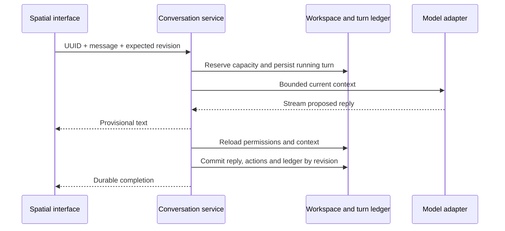

# Field

[ourfield.live](https://ourfield.live) · [Production deployment](docs/deployment.md)

**She remembers you. You still get to change.**

Field is a persistent companion runtime with a spatial interface. Nia carries a saved identity, memories, relationships and unfinished plans across conversations and model changes. Her understanding stays open to correction: revise a memory, review related plans, and continue from the updated context.

The runtime separates durable state from model inference. Models propose replies and bounded actions; Field validates permissions, context versions and storage revisions before committing them.

## Meet Nia

Nia is a 28-year-old Black woman with an observant eye, dry humor and a habit of giving unfinished ideas a shape. She can be affectionate, have a point of view, and recognize when company matters more than a plan. Her character asks how to remember someone without deciding who they have to remain.

Read [Nia’s character, visual and voice specification](docs/nia.md). Her identity and palette are shared by the model adapters and spatial body; spoken voice is a defined next step.

## Run locally

Node.js 22.13 or newer is required.

```sh
git clone https://github.com/OurFieldLabs/field.git
cd field
npm ci
npm run db:setup
npm run dev -- --port 3001
```

Open **http://localhost:3001/space**. Room controls work without a model; conversations require a connection. The local database is created from committed migrations; no cloud account is needed for development.

For real local inference, install Ollama. Keep its service running in one terminal and download the model from another:

```sh
npm run model:serve
```

```sh
npm run model:pull -- <your-model>
```

Create `.dev.vars` with:

```dotenv
FIELD_AI_ENABLED="true"
FIELD_AI_PROVIDER="ollama"
FIELD_AI_MODEL="your-model"
FIELD_AI_CONCURRENCY="1"
FIELD_AI_VISITOR_TURNS="100"
```

Restart Field. The space selects the local model when reachable. Model weights are downloaded separately and are not included in this repository. [Setup and configuration](SETUP.md) covers shared hosted inference, personal connections, export and troubleshooting.

## Core mechanisms

### Correctable continuity

A correction creates a memory record linked through `supersedes` and `supersededBy`. The previous record remains inspectable but leaves recall. A workspace-wide `memoryVersion` prevents pre-correction dialogue and action receipts from re-entering subsequent model context. Results prepared before that boundary cannot commit.

Corrections include a review of open plans and spatial notes. Only the user's selected keep, rewrite or remove decisions apply. A stale review is rejected before changing any records. Plans record which memories were available at creation; that metadata describes context exposure, not proven causation.

### Transactional actions

```ts
type Action =
  | { type: 'move'; zone: 'center' | 'desk' | 'window' }
  | { type: 'note'; text: string; zone: 'center' | 'desk' | 'window' }
  | { type: 'task'; title: string }
  | { type: 'complete_task'; taskId: string };
```

The complete batch is checked against current state and permissions. A rejected batch leaves no partial movement, note, plan or assistant message. Tasks are persistent to-do records; they do not execute external work.

### Durable conversation lifecycle

The browser sends only a request UUID, message and expected workspace revision. The server resolves identity, selects saved context, reserves capacity, persists a running request, streams provisional text, and commits the validated reply, actions and usage record atomically.

Request IDs support idempotent replay. Durable cancellation handles a stop arriving before start. Lost connections reconcile the original request rather than automatically starting another inference. Expired reservations are recovered when the workspace is accessed.



### Bounded recall and inference

BM25 retrieval selects up to eight current memories within a 6,000-character budget. Pins take priority, followed by lexical relevance; recent records provide a fallback when nothing matches. Each selected record is capped at 1,000 characters in the request. Saved records remain intact.

Additional context has explicit limits: 12 relationships, 20 open tasks, eight spatial notes, 12 recent messages and eight action receipts. Native Ollama output is schema-constrained; incomplete responses and invalid usage reports are rejected. Local requests reserve output capacity within a 16K context and reject oversized input before inference.

### Isolation and resource accounting

Visitors receive independent cryptographic credentials in HTTP-only cookies. Workspace keys are derived by SHA-256. Requests enforce same-origin boundaries and revision-checked writes.

A separate server-owned ledger enforces per-visitor attempts, global attempts, concurrency and conservative cost reservations through conditional database writes. Failed and cancelled attempts retain reservations. Importing or clearing a workspace does not reset usage. Local inference has zero API cost and still counts toward request limits.

## Architecture

| Layer                              | Implementation                                                  |
| ---------------------------------- | --------------------------------------------------------------- |
| Spatial interface                  | React, Three.js, accessible controls and reduced-motion support |
| Conversation lifecycle             | `hooks/use-companion.ts`                                        |
| Persistence and draft recovery     | `hooks/use-workspace.ts`, `lib/workspace-draft.ts`              |
| State transitions and permissions  | `lib/entity.ts`, `lib/runtime.ts`                               |
| Recall and correction transactions | `lib/memory.ts`, `lib/memory-repair.ts`                         |
| Inference protocols                | Streaming SSE and native Ollama NDJSON                          |
| Authoritative storage              | D1/SQLite, prepared statements, revision compare-and-swap       |
| Schema evolution                   | Committed Drizzle migrations                                    |

[Architecture](ARCHITECTURE.md) · [Consistency contract](docs/consistency.md) · [HTTP API](docs/api.md) · [Verification](docs/verification.md)

## Verify the implementation

```sh
npm run check
```

This runs types, lint, unit tests, fresh-database integration tests, source packaging and a production build. The integration runner creates its own temporary source copy, database and explicitly fake provider. It exercises persistence, isolation, incremental streaming, cancellation, replay, stale context, permission changes, expired leases and both global allowance limits. It uses no personal workspace, live model or provider credential.

```sh
npm run test:unit
npm run test:integration
```

GitHub Actions runs the same check on pushes and pull requests. Live model quality, browser usability and production load are separate evaluations. See [verification boundaries and reproduction](docs/verification.md).

## Data ownership and current scope

Identity and context are application data, independent of the selected model. Export/import preserves the canonical workspace and excludes model connection credentials. Temporary tab-local drafts can survive a reload; restoration requires an unchanged server revision. Conflicting drafts remain exportable without overwriting newer content.

The current release uses browser-cookie identity. Account recovery, device synchronization, semantic recall, voice and physical-room perception remain planned work. Server-local Ollama is a development mode; a public deployment requires an independently reachable model service, monitoring and abuse controls.

## Contribute

Read [CONTRIBUTING.md](CONTRIBUTING.md) for development and [SECURITY.md](SECURITY.md) for trust boundaries. Changes should preserve the tested consistency contract and include a reproducible failure case when fixing a bug.
