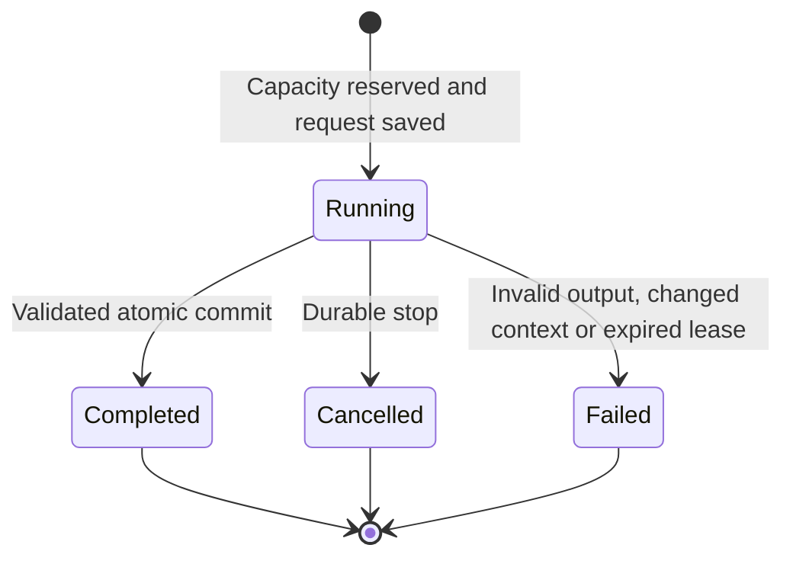

# Consistency contract

This document describes implemented behavior and the tests that exercise it. The database provides authoritative serialization; model calls and browser streams are outside that transaction.

## State and versions

A workspace snapshot `W` has a database revision `r` and a memory-context version `m`. The revision advances for every committed workspace write. The memory version advances when an understanding is corrected. They serve different purposes: `r` prevents lost updates, while `m` prevents inference from crossing a correction boundary.

An ordinary write succeeds only when its supplied revision equals the stored revision:

```sql
UPDATE workspaces
SET data = ?, revision = revision + 1, updated_at = ?
WHERE id = ? AND revision = ?;
```

Zero changed rows mean conflict, not permission to overwrite. Scope comes from the visitor credential. Serialized browser saves keep later edits pending until the preceding revision is acknowledged.

## Memory correction

The active set is the set of memories without `supersededBy`. Correction is an explicit transaction:

1. Prepare a preview of the current memory, context version and complete task/note snapshot.
2. Collect one keep, rewrite or remove decision for each reviewed record.
3. Recompute and compare the preview against current state.
4. Link the original and replacement records, apply only reviewed edits, and increment `memoryVersion` together.

Any mismatch rejects the whole transaction. Superseded records remain history and never become active automatically after a descendant is deleted. Subsequent context excludes dialogue and receipts from earlier memory versions while preserving them in visible history.

The policy intentionally favors explicit correction over retaining all historical dialogue in model context. Semantic interpretation of a correction is not guaranteed by lexical recall.

## Action commit

`completeTurn` requires a running request, an un-aborted signal, a current memory version and eligible recalled memories. The server-managed path also compares selected memory text/source and the prepared run snapshot. It then validates the complete action batch against current permissions and constructs new workspace state.

Only after that succeeds does the service attempt the database commit. The workspace update and terminal ledger transition occur in the same transaction. A concurrent revision change causes a bounded reload/revalidation attempt, never an unconditional overwrite.



Terminal results cannot execute again. The durable ledger records request status independently from editable runtime history.

## Idempotency and cancellation

Each shared request has a UUID and a fingerprint of its trimmed message. Reusing an existing ID with a different message is a conflict. Replaying the same request returns its durable status without calling the provider again. This is at-most-once application commit for the retained request ID, not a claim of exactly-once execution at an external provider.

Stopping before a POST creates a bounded cancellation tombstone. Stopping a running turn makes later completion ineligible. If completion was already committed, it wins and the client reloads that result. A disconnected client reconciles the original request rather than making an automatic paid retry.

## Capacity and cost

Admission checks the current revision, per-workspace active request, global concurrency, per-visitor attempts, global attempts and conservative cost reservation in a conditional insert. The begin-state update is coupled to that reservation.

Actual attempts are identified by a nonempty `run_id`, so a zero-cost local request still counts and a cancellation tombstone does not. Budget accounting uses the greater of reserved and reported cost. Failure and cancellation retain reservations. Daily windows use UTC. This is an application allowance, not a guarantee about provider billing.

## Tested ordering properties

`tests/consistency.test.ts` enumerates all 24 orders of completion, correction, permission revocation and cancellation for one prepared response. Each transition checks workspace validity and absence of partial mutation on rejection. A task batch may commit only if completion precedes all three invalidating events. The test also checks that subsequent recall excludes the superseded memory.

This is deterministic exploration of a bounded state-transition scenario, not a general distributed-systems proof. HTTP/D1 tests separately cover real request admission, concurrent visitors, stale writes, durable stops and expired leases.

## Boundaries

Identity, task records, relationships and unselected memories can change independently. This contract does not provide external side-effect rollback, immutable audit history, distributed model consensus or account recovery. Any extension to external actions must define its own authorization, idempotency and recovery semantics.
